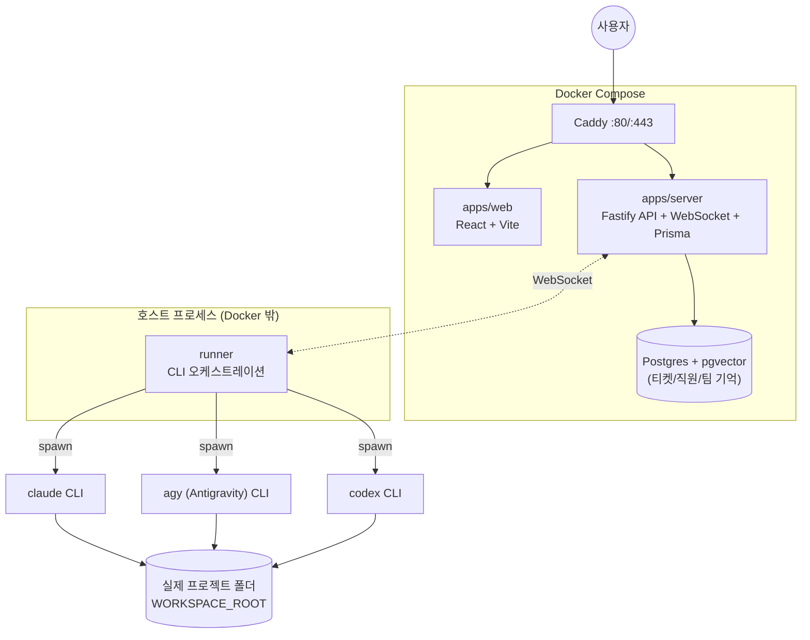

# ai-crew

Claude Code가 **팀장**을 맡고, Claude/Antigravity/Codex CLI가 **직원**을 맡는 AI 개발팀 오케스트레이터.
사용자가 팀장에게 한 번 요청하면 작업을 쪼개 적합한 직원에게 티켓으로 위임하고, 웹 조직도에서 실시간
진행 상황을 보고 개입할 수 있다.

## 목적

여러 프로젝트를 동시에 굴릴 때, 사람이 매번 "이번엔 어느 프로젝트를 누가 작업하지"를 직접 챙기는 대신
실제 회사 조직처럼 **팀장 1명이 위임하고 여러 직원이 각자 담당 프로젝트에서 병렬로 작업**하게 만든다.

- 팀장/직원 모두 API 과금이 아니라 **CLI 구독 요금제**로 돈다 (Claude Max, ChatGPT Plus/Pro 등).
- 직원은 격리된 브랜치가 아니라 **프로젝트 실제 폴더에서 직접 커밋**한다 — 별도 병합 과정이 없다.
- 담당 밖의 일이 필요하면(`blocked`) 팀장이 자동으로 깨어나 다른 직원에게 새 티켓을 발행하고,
  완료되면 원래 작업이 자동으로 재개된다.

자세한 설계 배경은 [`docs/PLAN.md`](./docs/PLAN.md) 참고.

## 아키텍처



| 컴포넌트 | 역할 | 실행 위치 |
|---|---|---|
| `apps/web` | 조직도 UI (React) — 팀/직원 관리, 티켓 상태, 팀장 채팅 | Docker |
| `apps/server` | Fastify REST API + WebSocket + Prisma. 티켓 상태머신, MCP 서버(팀장/직원용 툴) | Docker |
| `infra` | `docker-compose.yml`(postgres/server/web/caddy) + `Caddyfile` | - |
| **`runner`** | **claude/agy/codex CLI를 실제로 `spawn`하는 유일한 프로세스** | **호스트(Docker 밖)** |
| `packages/shared` | 서버·웹·러너가 공유하는 티켓/이벤트/모델 타입 | - |
| `agents/manager.md` | 팀장 시스템 프롬프트 (모든 팀이 공유) | - |

**서버/DB/웹은 Docker, 러너만 호스트에서 직접 돈다.** 러너가 실행하는 CLI들이 실제 프로젝트의
JDK/Gradle/Node/Go 툴체인, git, 그리고 사용자가 로그인해둔 CLI 세션을 그대로 써야 하기 때문에
컨테이너로 격리할 수 없다. 서버와 러너는 WebSocket으로 붙어 티켓 배정/진행 이벤트를 주고받는다.

## 빠른 시작

```bash
git clone https://github.com/SangkiHan/ai-crew.git
cd ai-crew
pnpm install
pnpm start
```

`pnpm start` 하나로 아래가 순서대로, **전부 백그라운드로** 진행된다 (터미널을 붙잡고 있을 필요 없음):

1. `.env`가 없으면 `scripts/setup.mjs`가 AI 직원들이 작업할 프로젝트 폴더(`WORKSPACE_ROOT`)를 물어보고
   `.env`를 만든다. **직접 채워야 하는 절대경로는 이것 하나뿐이다.**
2. `docker compose up -d --build`로 postgres/server/web/caddy를 띄운다.
3. 서버가 `/health`에 응답할 때까지 최대 60초 대기.
4. `prisma db push`로 DB 스키마 동기화 (여러 번 실행해도 안전).
5. 러너(`pnpm --filter @ai-crew/runner dev`)를 detached로 띄운다. 로그는 `.run/runner.log`,
   pid는 `.run/runner.pid`.

```bash
tail -f .run/runner.log   # 러너 로그 실시간으로 보기
pnpm stop                 # 러너 + docker 전부 내리기 (DB는 volume에 남음)
```

브라우저에서 `http://localhost` 접속 → **"직원 관리"**로 직원을 추가하고, 채팅창에 팀장에게 할 일을
말하면 된다.

**Windows/macOS 어디서나 동작한다** — 경로 계산에 `os.homedir()`/`path.join`만 쓰고, 셸을 거치지 않는
`execFile`/`spawn`만 쓴다. 다만 `claude`/`agy`/`codex` CLI와 실제 프로젝트의 툴체인(JDK/Node/Go 등)은
그 운영체제에 미리 설치·로그인되어 있어야 한다.
